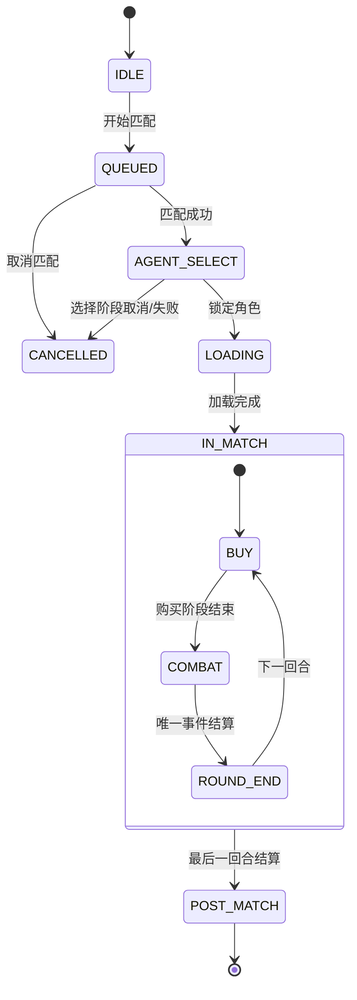

# 对局状态机

```mermaid
stateDiagram-v2
    [*] --> IDLE
    IDLE --> QUEUED: 开始匹配
    QUEUED --> AGENT_SELECT: 匹配成功
    QUEUED --> CANCELLED: 取消匹配
    AGENT_SELECT --> LOADING: 锁定角色
    AGENT_SELECT --> CANCELLED: 选择阶段取消/失败
    LOADING --> IN_MATCH: 加载完成
    IN_MATCH --> POST_MATCH: 最后一回合结算
    POST_MATCH --> [*]

    state IN_MATCH {
        [*] --> BUY
        BUY --> COMBAT: 购买阶段结束
        COMBAT --> ROUND_END: 唯一事件结算
        ROUND_END --> BUY: 下一回合
    }
```

## 设计重点

- 每个动作同时检查对局状态和局内阶段，防止越级调用。
- 回合结算先检查 `round_event_id` 是否已处理，再检查当前阶段，使延迟重放可以被幂等忽略。
- 断线不是业务状态迁移，不改变局内阶段；重连后恢复服务端权威快照。
- 真实系统还需要补充超时、选人失败、加载失败、投降、重赛及异常终局等分支。

